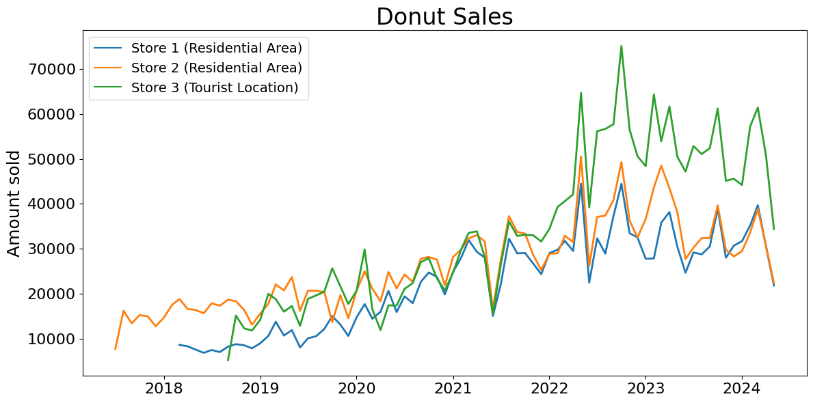
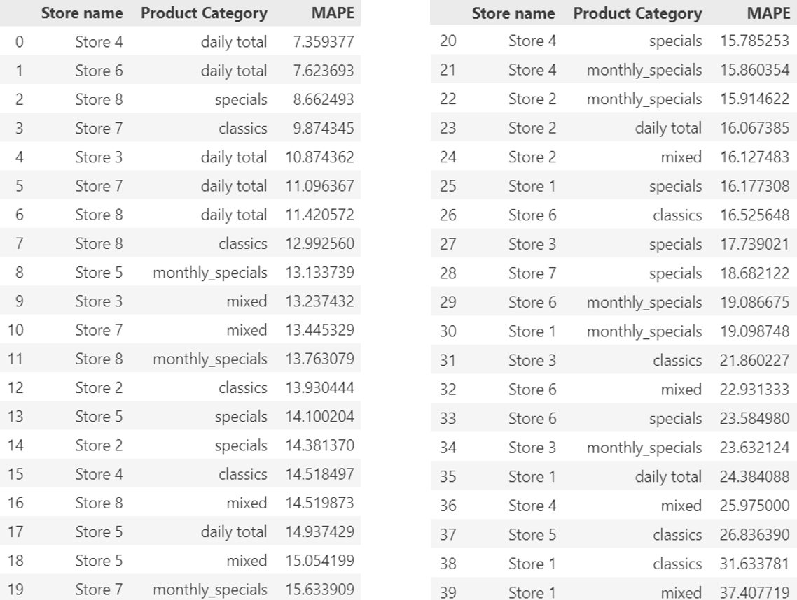
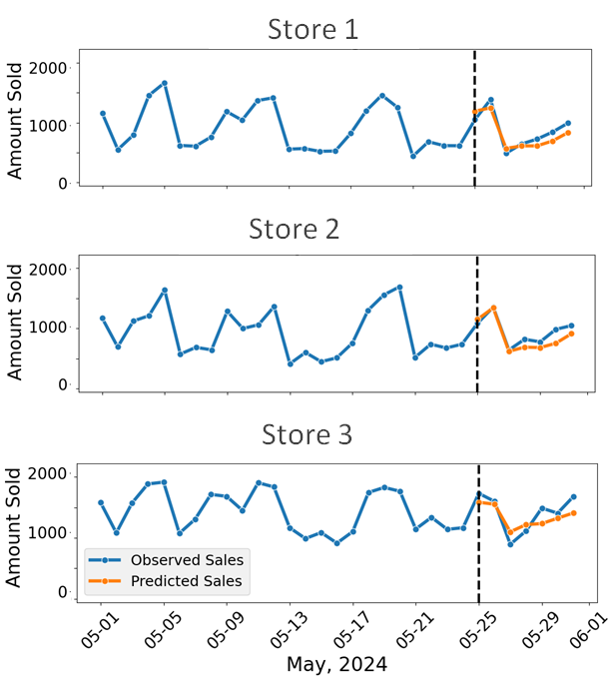
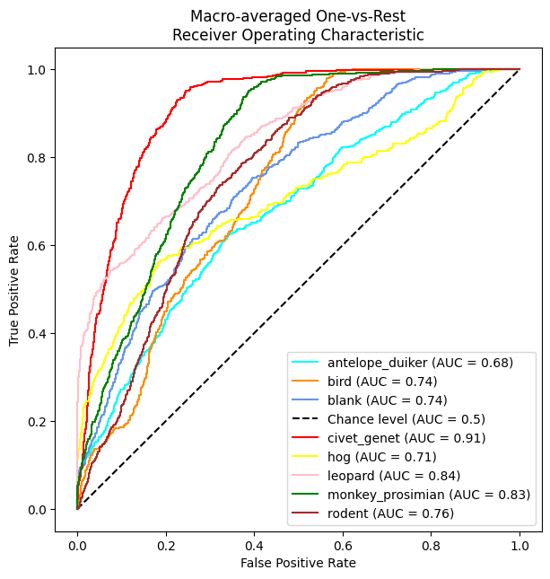
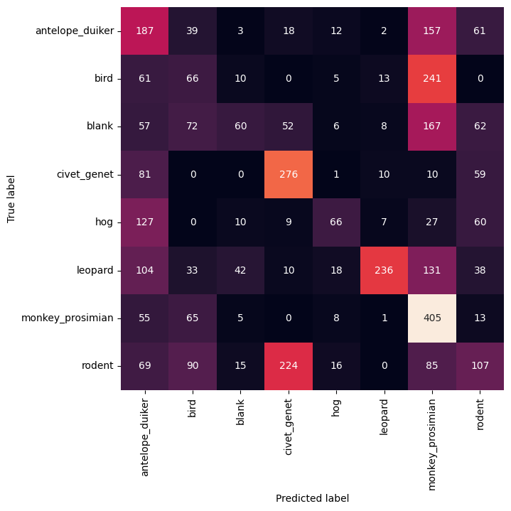
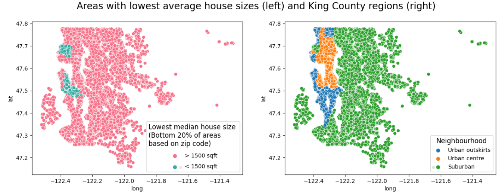
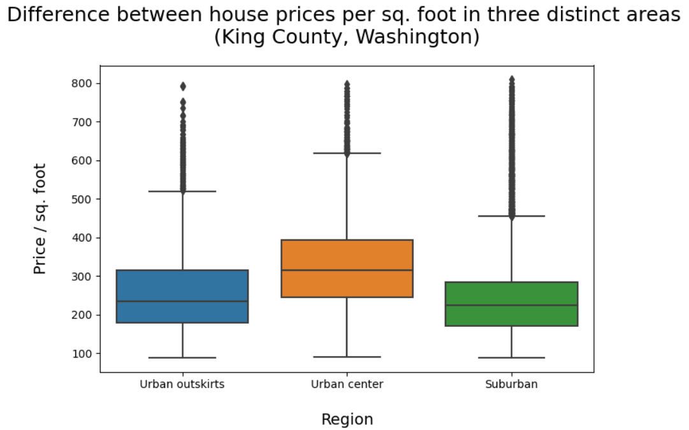

# Data Science Project Portfolio

Welcome to my page!

I am Vlatko Vilović, a social and environmental scientist passionate about exploring the world between data science, sustainability and society.

I believe that the power of machine learning and data-driven technologies can be harnessed to address global challenges such as climate change, overconsumption, and resource inequality.

My portfolio will hopefully intrigue not only those who share my interests but also resonate with anyone curious about the potential of machine learning technologies to create a more sustainable future.

Have questions? Feel free to reach out!  

### <ins>**<a href="https://www.linkedin.com/in/vlatko-vilovic/" style="color: #3195E7;">Linkedin</a>**</ins>

   

## Education

|   |   |   |   
|----|----|----|
| **Data Science    Training Program**    | *SPICED Academy*  (Berlin, Germany)   | Apr 2024 -   Jul 2024   |
|  **Master Environmental    Policy and Planning**  | *Berlin Institute of Technology /   Freie Universität*   (Berlin, Germany) | Oct 2013 -   Mar 2017    |
| **Honors Bachelor    Political Science**  | *Hunter College, CUNY*   (New York City, US)    | Aug 2009 -   May 2013   |

 

### Technical Skills

**Python, SQL, Pandas, Numpy, scikit-learn, Seaborn, Matplotlib, Tensorflow/Keras, Git**

  

## Relevant Work Experience
**Project manager | Research Associate** *inter 3 - Institute for resource management* 
Sep 2021 - Feb 2024 (Berlin, Germany)

- Data analysis - Applied discrete choice and regression models in R and Python. I modelled rural coworking space utilisation for assessing car emissions reductions as well as the effects of local mobility measures on air quality. Automated GIS models to identify suitable agricultural land for water reuse.
- Project management - Lead of 2 citizen science-based pilot experiments on air quality and traffic measurements as part of the Horizon 2020 COMPAIR project. Organised and moderated 9 workshops with citizens on air quality, data and visualisation technologies
- Served as Agile Product Owner for an AR app on air quality visualisation, coordinating between 3 main stakeholders to prioritise 30+ user stories using Jira.

**Project manager | Communications Lead** *EPC gGmbH - Project Corporation for Climate. Sustainability. Communication* 
Mar 2019 - Aug 2021 (Berlin, Germany)

- Project management - Prepared statistical and environmentally-extended Input-Output analyses (EEIO) to develop two EU Horizon 2020 projects on energy citizenship and resource management.
- Knowledge-transfer lead - Applied target-specific communication strategies via social media, newsletters, brochures and presentations as part of the EU H2020 project E2DRIVER to disseminate project information to key stakeholders   

# My Projects
*Click on project titles for a more detailed overview.*

---

## <ins>[sweetspot - A Time-Series Forecasting Model for Reducing Food Waste](https://github.com/vlatko-v/sweet-spot-donut-sales-forecasting)

Operating a food business comes with a unique set of challenges. Apart from health and safety standards or supply chain disruptions, the Food & Beverage (F&B) sector is struggling with perishability and waste, with roughly one-third of food being discarded every year.

In light of this challenge, this project aims to ameliorate the issue of food waste by developing a planning tool - called sweetspot - for more precise sales forecasting of a German donut manufacturer. By applying machine learning, this project can support accurate sales planning and better inventory management through the use of a wide variety of input information.

---

## <ins>[Conser-Vision: Classifying Images of Wildlife Species via CNN](https://github.com/vlatko-v/drivendata-Conser-vision-Image-Classification)

Camera traps are a tool used by conservationists to study and monitor a wide range of ecologies while limiting human interference. However, they also generate a vast amount of data that quickly exceeds the capacity of humans to sift through.

Using real-life images from the Taï National Park in Côte d'Ivoire, this project applies Transfer Learning and Image Augmentation techniques to create an image detection model based on Convolutional Neural Networks (CNN) that is suitable for classifying 7 types of animal species.

---

## <ins>[Exploratory Data Analysis (EDA): King County Housing Data](https://github.com/vlatko-v/ds-king_county_housing-EDA)

In this EDA project, I examined housing data from King County (WA, USA) in order to explore the characteristics of the local housing market for a fictitious client. The goal of the project was to provide him with at least three recommendations based on his requirements. 

Given that the client was looking for housing units in specific neighbourhood types, a large part of the process involved examining geographical features to recommend suitable areas and houses.

In a first such project, I learned how to meaningfully think about the business goal at hand, especially with respect to distinguishing between more and less relevant data to gain the most important insights. 

